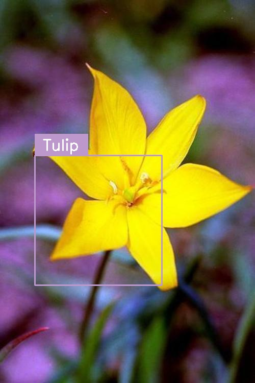

Object Detection using Tensorflow Fast R-CNN
===========================================

Tensorflow implementation of Fast R-CNN.
http://www.rossgirshick.info/  
Using 17 Category Flower Dataset.
http://www.robots.ox.ac.uk/~vgg/data/flowers/17/
	
	Fast R-CNN
	Ross Girshick
	IEEE International Conference on Computer Vision (ICCV), 2015

Training Usage
-----

    python TrainingModel.py train_data_file finetune_data_file max_epoch batch_size
    	output_cnn_model_file output_cnn_mean_file
    
    ex)
    python TrainingModel.py ./data/train_data.txt ./data/finetune_data.txt 3 3
    	./alexnet/alexnet_model.npy ./alexnet/alexnet_mean.txt

Training Result
-----

Detection Usage
-----

    python DetectionImage.py cnn_model_file cnn_mean_file
    	label_file input_image_file output_image_file
    
    ex)
    python DetectionImage.py ./alexnet/alexnet_model.npy ./alexnet/alexnet_mean.txt
    	./alexnet/flower_classes.txt ./example/tulip.jpg ./example/tulip_result.jpg

Detection Result
-----

 
